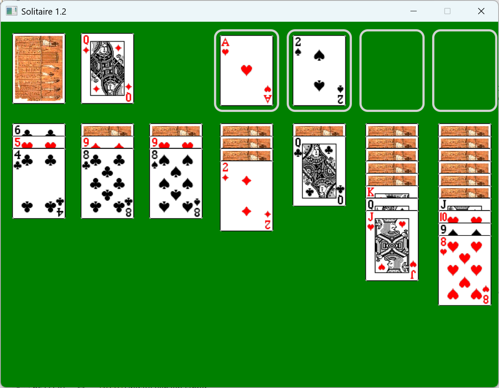

# Solitaire
Implementation of a [Solitaire card game](https://en.wikipedia.org/wiki/Patience_(game)) with [JavaFX](https://openjfx.io/). 

Demonstration application used in the book [Introduction to Software Design with Java, 2nd edition](https://link.springer.com/book/10.1007/978-3-030-97899-0). 
[Release 1.2](https://github.com/prmr/Solitaire/tree/v1.2) is consistent with the [2nd edition](https://link.springer.com/book/10.1007/978-3-030-97899-0) of the book. [Release 1.0](https://github.com/prmr/Solitaire/tree/v1.0) is consistent with the [1st edition](https://www.springer.com/us/book/9783030240936).

## Building the Application

This repository is configured to build automatically in Eclipse with Java 21 and JavaFX 21.

However, when first imported, the project will show a compilation error because the JavaFX dependency is missing.

To add JavaFX:

1. Download [JavaFX 21](https://jdk.java.net/javafx21/);
2. Create a new `User Library` under `Eclipse -> Window -> Preferences -> Java -> Build Path -> User Libraries -> New`. Name it `JavaFX21` and include the jars under the `lib` folder from the location where you extracted the JavaFX download.

The project should then build properly.

## Running the Application

Right-click on the project and select `Run As -> Java Application`. Select `Solitaire` from the list. 

To run the tests, select `Run As - > JUnit Test`.

There are also two driver programs, `Driver` and `CrashTest`, which run the application in headless mode (that is, without the GUI).

## Playing the Game

* Click on the deck of cards (top left) to draw/reveal a new card.
* Drag and drop cards to the _foundation piles_ (at the top) or to piles in the _tableau_ (at the bottom). Cards in foundations piles must be of the same suit, in strictly consecutive ascending rank. Cards in the tableau must be in strictly consecutive decreasing rank, but in alternating suit color, as illustrated above.
* Press <kbd>Enter</kbd> to automatically play a move.
* Press <kbd>Backspace</kbd> to undo the last move.

